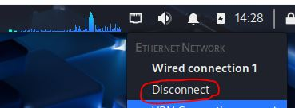
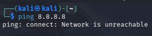
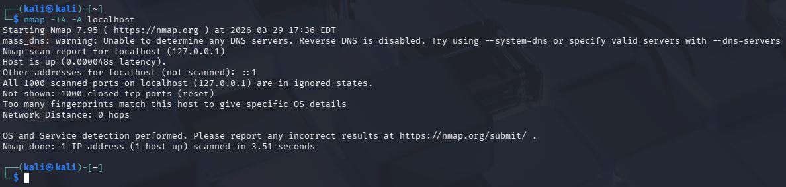
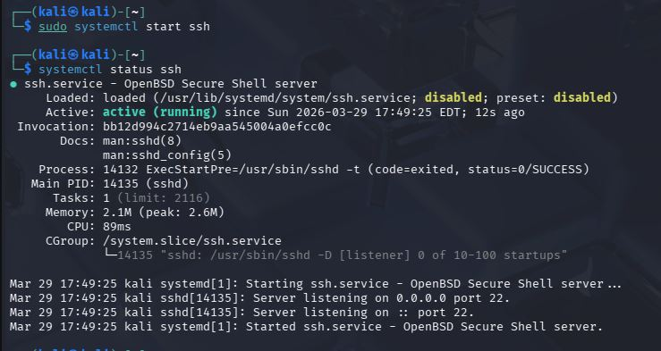
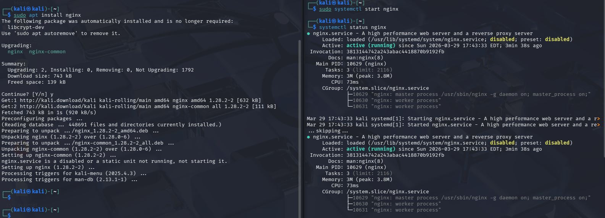
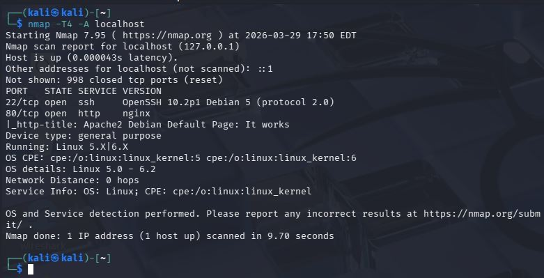
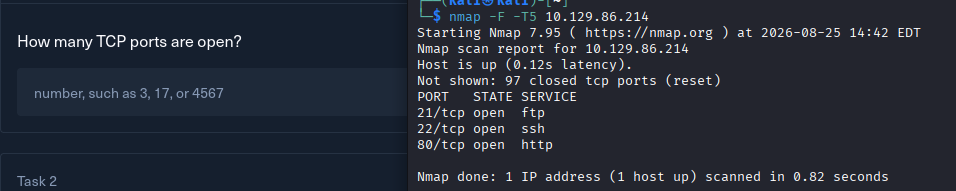
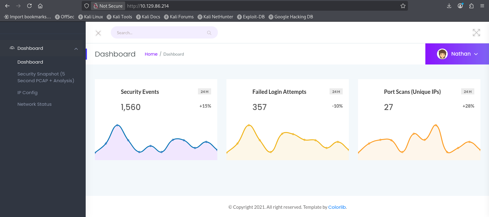
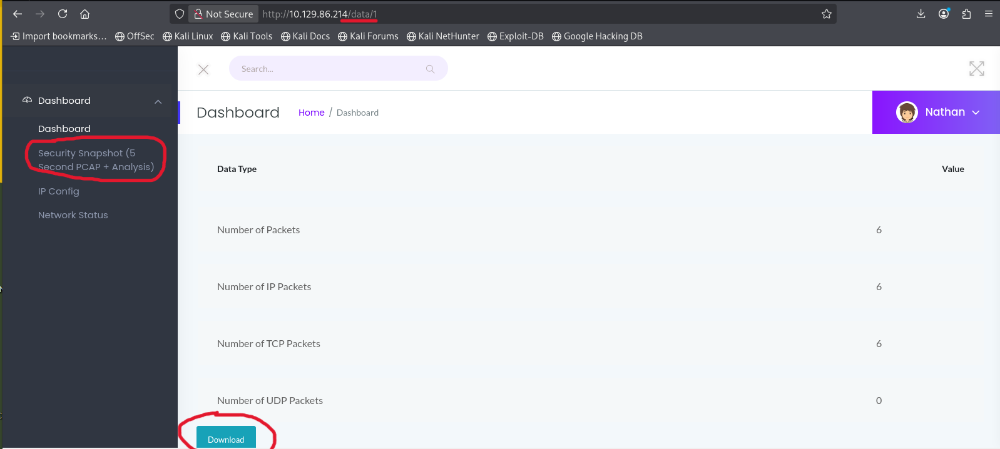

# h1 Kybertappoketju
[Tero Karvinen 2026 early autumn: Tunkeutumistestaus, h1 Kybertappoketju](https://terokarvinen.com/tunkeutumistestaus/#h1-kybertappoketju)

### En halua toistaa itseäni
Osa tehtävistä on kopioitu raportistani aiemmalta toteutukselta. Vältän tekemästä aiempia temppuja uudestaan. Joissain tehtävissä on mahdollista yrittää uusia ratkaisuja ja aion niissä kokeilla toisia menetelmiä.

## x)  Lue/katso/kuuntele ja tiivistä.

### Herrasmieshakkerit
[Herrasmieshakkerit Erikoistilanteiden asiantuntija, vieraana Juhani Mäkinen | 0x45 Jun 16, 2026](https://herrasmieshakkerit.fi/)
Podcast jakso Mikko Hyppönen ja Tomi Tuominen, vieraana Juhani Mäkinen. Aiheena turvallisuus ja turvallisuusriskien hallinta. 
- Hyppönen saanut lahjaksi koreassa nimikko leimasimen itselleen.
- Juhani Mäkinen, entinen sotilas ja nykyinen turvallisuusalan yrittäjä.
- Turvallisuus johtaminen. Juhani nostaa ongelman, että ei mietitä tarpeeksi ihmisen käyttäytymisen kannalta suunnittelua.
- Avainhenkilönsuojaus. Mahdollisuus vaikuttaa jonkun henkilön kautta organisaatioon voi tehdä tästä henkilöstä korkeanprofiilin yksilön. Toisaalta perinteisemmät, kuten varallisuus voi tehdä korkeanprofiilin henkilöksi.


### 3.2 Intrusion Kill Chain <br> (Aiemmasta [raportista](https://github.com/SamiYli/Tunkeutumistestaus/blob/main/h1.md) )
[Hutchins et al 2011: Intelligence-Driven Computer Network Defense Informed by Analysis of Adversary Campaigns and Intrusion Kill Chains: 3.2 Intrusion Kill Chain](https://lockheedmartin.com/content/dam/lockheed-martin/rms/documents/cyber/LM-White-Paper-Intel-Driven-Defense.pdf)

Kyber tappoketju on systemaattinen maalittamisen ja hyökkäämisen prosessi.
Seitsemän tappoketjun vaihetta:
- Reconnaissance, etsitään kohteita ja haavoittuvuuksia.
- Weaponization, hyödynnetään haavoittuvuutta ja/tai luodaan haittaohjelma.
- Delivery, saatetaan haittaohjelma kohteeseen.
- Exploitation, haittaohjelma alkaa toimia kohteessa.
- Installation, ladataan etäkäyttö työkalu kohteeseen tai luodaan takaportti.
- Command and Control, haittaohjelma ja hyökkääjä muodostavat yhteyden.
- Actions on Objectives, hyökkääjä tekee rikoksiaan kohteessa ja/tai käyttää sitä alustana hyökätä muualle samassa verkossa.


### 4.3 Surveying Essential Tools for Active Reconnaissance. <br> (Aiemmasta [raportista](https://github.com/SamiYli/Tunkeutumistestaus/blob/main/h1.md) )
[Santos et al: The Art of Hacking (Video Collection): 4.3 Surveying Essential Tools for Active Reconnaissance.](https://learning.oreilly.com/videos/the-art-of/9780135767849/9780135767849-SPTT_04_00)

Aktiivinen tiedustelu: Porttien skannaus eli avoimien porttien etsiminen, web-sovelluksien tutkailu, haavoittuvuuksien etsiminen.
- NMAP porttiskanneri ja palvelun havaintseminen.
- MASSCAN, nopea porttiskanneri.
- UDP-proto-scanner, UDP protokolla skanneri.
- EyeWitness, web-sovelluksien tutkailu.

### KKO:2003:36  <br> (Aiemmasta [raportista](https://github.com/SamiYli/Tunkeutumistestaus/blob/main/h1.md) )
[Korkeimman oikeuden ennakkopäätös, KKO:2003:36](https://www.finlex.fi/fi/oikeuskaytanto/korkein-oikeus/ennakkopaatokset/2003/36)

Osuuspankkiin tehty porttiskannaus oli aiheuttanut pitkän oikeusprosessin. Teko tulkittiin tietomurron yritykseksi ja sen selvittämisestä aiheutuneista kuluista oli vaadittu rahallista korvausta.


## a) Asenna Kali virtuaalikoneeseen
(Aiemmasta [raportista](https://github.com/SamiYli/Tunkeutumistestaus/blob/main/h1.md) )

Olen aiemmin ladannut valmiin Kali virtuaalikoneen. Sen käyttöönotto tapahtui helposti VirtualBox sovelluksessa lisäämällä.
- kali-linux-2025.4-virtualbox-amd64
  - Debian (64-bit)
  - 2048 MB base memory
  - 2 vCPU
  - Intel NAT Network adapter
    
  [www.kali.org kali pre-built virtual machines - virtualbox](https://www.kali.org/get-kali/#kali-virtual-machines)

## b) Irrota Kali-virtuaalikone verkosta. Todista testein, että kone ei saa yhteyttä Internetiin
(Aiemmasta [raportista](https://github.com/SamiYli/Tunkeutumistestaus/blob/main/h1.md) )



Koneessa ei pitäisi olla yhteyttä. Testataan ping komennolla saadaanko googlen avoin DNS vastaamaan:
```
ping 8.8.8.8
```



## c) Porttiskannaa 1000 tavallisinta tcp-porttia omasta koneestasi
(Aiemmasta [raportista](https://github.com/SamiYli/Tunkeutumistestaus/blob/main/h1.md) )

Komennolla:
```
nmap -T4 -A localhost
```
[nmap Options Summary](https://nmap.org/book/man-briefoptions.html)
```
-T4 nopeuttaa skannausta
```
```
-A Ottaa käyttöön: OS detection, version detection, script scanning, and traceroute
```



Ei yhtäkään porttia auki.

## d) Asenna kaksi vapaavalintaista demonia ja skannaa uudelleen. Analysoi ja selitä erot.
(Aiemmasta [raportista](https://github.com/SamiYli/Tunkeutumistestaus/blob/main/h1.md) )

Otan ssh palvelimen ja web-palvelimen tutkailtavaksi.
Minulla on jo openssh, mutta lataan nginx web-palvelimen.

                       

Käynnistin molemmat demonit ja suoritin sen jälkeen uuden skannauksen.



Nyt koneella on kaksi porttia auki, 22 ja 80. Portti 22 on oletus ssh-protokollan portti. Portti 80 on oletus http-protokollan portti.
nmap tunnistaa prosessit OpenSSH ja NGINX.
Nmap jopa huomasi enemmän tietoa käyttöjärjestelmästäni.
```
Os Linux 5.0 - 6.2
```

## e) Ratkaise vapaavalintainen kone HackTheBoxista.
Olen läpäissyt aiemmin keväällä muutaman HackTheBox koneen, joista on valmista raporttia luettavissa ().

Olen tekemässä tälle syksyä uutta konetta "CAP", mutta en vielä ehtinyt läpäistä sitä. Tässä seuraavaksi, mitä olen ehtinyt:

### CAP


Yhdistin OpenVPN:llä HTB harjoituskoneelle. HTB:n sivun ohjeita noudattamalla latasin HTB:n sivulta .ovpn tiedoston ja antamalla sen sitten OpenVPN:lle.

```
cd Downloads
```
```
sudo openvpn ovpntiedosto.ovpn
```
Siitä se sitten lähtee yhdistämään.


Jätän tämän shellin taustalle auki ja avaan uuden terminaali ikkunan, jossa aletaan sitten penetroimaan kapua.


Ensiksi minua kiinnostaa avoimet portit. Siispä nmap aukinaisista porteista:

```
nmap -F -T5 <ip-osoite>
```
Skannaa ensimmäiset 100 yleisintä porttia parametrillä:
```
-F
```
Otetaan nopeampi skannaus:
```
-T5
```



Katsokaas nyt! FTP, SSH ja HTTP auki. Näistä voidaan alkaa jo innostua. Vastaus ensimmäisessä taskissa on 3. 

Päätin katsoa selaimella pääsenkö käsiksi web palveluun, joka pyörii portissa 80.



Security dashboard! Melkoista settiä.

Task 2. vinkki oli: "Run a scan and look at the URL of the page you are redirected to. This part is the same every time." <br>
Tämä antaa ajatuksen katsoa mitä tapahtuu Security Snapshot (5 second PCAP + Analysis) kohdasta, napsauttamalla sivupaneelista.



URL muuttui! Saadaan Download napista ladattua pcap tiedosto. Nyt vaikuttaisi siltä, että url:issa näkyy hakemisto /data ja sen alla indeksi tai id /1. <br>
Task 2. vastaus on "data"

Voisinkohan tällaista IDOR haavoittuvuutta hyödyntäen ladata muita pcap tiedostoja?

### ToBeContinued

## Lähteet
- [Tero Karvinen, tunkeutumistestaus ](https://terokarvinen.com/tunkeutumistestaus/) <br> (https://terokarvinen.com/tunkeutumistestaus/)
  
- [Herrasmieshakkerit](https://herrasmieshakkerit.fi/) <br> (https://herrasmieshakkerit.fi/)
  
- [Santos et al: The Art of Hacking (Video Collection): 4.3 Surveying Essential Tools for Active Reconnaissance.](https://lockheedmartin.com/content/dam/lockheed-martin/rms/documents/cyber/LM-White-Paper-Intel-Driven-Defense.pdf) <br> (https://lockheedmartin.com/content/dam/lockheed-martin/rms/documents/cyber/LM-White-Paper-Intel-Driven-Defense.pdf)
  
- [Finlex, korkeinoikeus ennakkopäätökset](https://www.finlex.fi/fi/oikeuskaytanto/korkein-oikeus/ennakkopaatokset/2003/36) <br> (https://www.finlex.fi/fi/oikeuskaytanto/korkein-oikeus/ennakkopaatokset/2003/36)
- [Santos et al: The Art of Hacking (Video Collection)](https://learning.oreilly.com/videos/the-art-of/9780135767849/9780135767849-SPTT_04_00) <br> (https://learning.oreilly.com/videos/the-art-of/9780135767849/9780135767849-SPTT_04_00)
- [nmap](https://nmap.org/book/man-briefoptions.html) <br> (https://nmap.org/book/man-briefoptions.html)
- [Redis CLI](https://redis.io/docs/latest/develop/tools/cli/) <br> (https://redis.io/docs/latest/develop/tools/cli/)
