# h5 Elokuu2026!
[Tero Karvinen 2026 late spring: Tunkeutumistestaus, Elokuu2026!](https://terokarvinen.com/tunkeutumistestaus/)

## Ympäristö
- kali-linux-2025.4-virtualbox-amd64
  - Debian (64-bit)
  - 4096 MB base memory
  - 2 vCPU
  - NAT Network adapter
  - Host-only network adapter
  - Firefox 128.3.1esr (64-bit)
 
- Metasploitable 2
  - Oracle Linux (64-bit)
  - 2048 MB base memory
  - 1vCPU
  - Host-only network adapter
 


## x) Lue/katso ja tiivistä. [Aiemmasta raportista](https://github.com/SamiYli/Tunkeutumistestaus/blob/main/h7.md?plain=1)
> (Tässä x-alakohdassa ei tarvitse tehdä testejä tietokoneella, vain lukeminen tai kuunteleminen ja tiivistelmä riittää. 
> Tiivistämiseen riittää muutama ranskalainen viiva kustakin artikkelista. Kannattaa lisätä myös jokin oma ajatus, idea, huomio tai kysymys.)

Karvinen 2022: [Cracking Passwords with Hashcat](https://terokarvinen.com/2022/cracking-passwords-with-hashcat/):
- Järjestelmät tallettavat salasanojen tiivisteitä, eli yksisuuntaisen funktion sekoitus salasanasta.
- Yksi salasana tuottaa uniikin tiivisteen. Jos arvaat salasanan, saat saman tiivisteen kuin alkuperäisen salasanan.
- Lataus ja käyttöohjeet tiivisteen murtamis työkalu hashcatille.
- Tunnistetaan tiivisteen tyyppi

Hashcat on siis bruteforce ohjelma. Tässä olisi ehkä voinut olla lisää tietoa myös sanakirjoista, mutta ehkä tiivisteiden murtamiseen pääsee alkuun ilman sitä.

----------------------------------------
Karvinen 2023: [Crack File Password With John](https://terokarvinen.com/2023/crack-file-password-with-john/)
- John the ripper sanakirja murtotyökalu
- Kootaan ohjelma
- Hyökätään salasanasuojattun zip-tiedostoon
- Irrotetaan salasanan tiiviste ja sitten sanakirjahyökätään johnilla.


----------------------------------------


Vapaaehtoinen: € Santos et al 2017: Security Penetration Testing - The Art of Hacking Series LiveLessons: [Lesson 6: Hacking User Credentials](https://www.oreilly.com/videos/security-penetration-testing/9780134833989/9780134833989-sptt_00_06_00_00/) (8 videos, about 30 min)


## a) Asenna Hashcat ja testaa sen toiminta murtamalla esimerkkisalasana. [Aiemmasta raportista](https://github.com/SamiYli/Tunkeutumistestaus/blob/main/h7.md?plain=1)
> [!IMPORTANT]
> Seurasin asentamisessa ja testaamisessa Teron ohjeita ja käytin samoja komentoja. Karvinen 2022: [Cracking Passwords with Hashcat](https://terokarvinen.com/2022/cracking-passwords-with-hashcat/)

### Asennetaan Hashcat
Tämä komento lataa tiivisteiden tunnistustyökalun hashid, tiivisteiden murtamistyökalun hashcat ja lataustyökalun wget:
```
sudo apt-get -y install hashid hashcat wget
```


Tarkistin vielä hashcatin version
> [!NOTE]
> Tämä oli oma komentoni: `hashcat --version`


### Teen hakemiston ja lataan sinne "rockyou.txt"-sanakirjan
Hakemisto on hyvä tehdä, jotta muiden kotitehtävien työt eivät mene sekaisin. Lataan sanakirjan tästä syystä sinne.
```
mkdir hashed
cd hashed
```
Lataan sanakirjan wget-työkalulla, ja koska se on pakattu tiedosto puran sen tar-työkalulla.

Lataaminen danielmeisslerin github varastosta SecLists:
```
wget https://github.com/danielmiessler/SecLists/raw/master/Passwords/Leaked-Databases/rockyou.txt.tar.gz
```


Nyt minulla on hakemisto jonne olen ladannut sanakirjan. Seuraavaksi sanakirjan purkaminen:
```
tar xf rockyou.txt.tar.gz
```
Vahvistin purkamisen onnistuneen listaamalla hakemiston sisällön ja katsomalla sanakirjan sisältöä `cat`-komennolla ja parametrillä `less`.


Tulostuksena tuli pitkä lista eri salasanoja. Niitä on aivain mieletön määrä, mutta tässä näkyy muutama:


Teron ohjeissa poistetaan pakattu tiedosto, purkamisen jälkeen. Tämä tehdään varmaankin vain siisteyden ylläpitämiseksi. Hyvä poistaa turhia tiedostoja, mutta mielestäni se ei ole tarpeellista, koska poistan tämän virtuaalikoneen pian kurssin jälkeen.

### Selvitetään esimerkki salasanan tiivistetyyppi
Jotta voisin saada oikeanlaisen tiivisteen vastaukseksi, minun pitäisi käyttää samaa tiivistys algoritmiä kuin alkuperäisen salasanan. Tätä varten hashid-työkalulla ensin selvitetään, mitä algoritmia tiivisteen tekoon käytettiin. Voisinkohan vain kokeilla kaikilla tunnetuilla tiivistys algoritmeilla yhtäaikaa eri salasanoja? Mitenhän kauan siinä menisi?


Esimerkki tiivisteen tunnistamis komento:
```
hashid -m 6b1628b016dff46e6fa35684be6acc96
```
Tulosteena sain tämän:


Kokeilen ensimmäisenä md5-algoritmiä, koska sitä käytettiin myös [Karvisen](https://terokarvinen.com/2022/cracking-passwords-with-hashcat/) ohjeessa. Annan oman nimen tiedostolle, jonne vastaus kirjoittuu.

Komennolla:
```
hashcat -m 0 '6b1628b016dff46e6fa35684be6acc96' rockyou.txt -o ratkaistu
```
`-m` parametri määrää käytettävän tilan, eli mitä tiiviste algoritmia käytetään.


Hashcat lopetti suorittamisen 2 sekunnin kuluttua ja antoi statuksen cracked:


Seuraavaksi käyn ratkaistu-tiedostosta katsomassa mikä ratkaisu oli:
```
cat ratkaistu 
```


_________________________________________________

> [!NOTE]
> B-tehtävää ei ollut kurssin sivuilla :(
_________________________________________________
## c) Asenna John the Ripper ja testaa sen toiminta murtamalla jonkin esimerkkitiedoston salasana.


### Asennan John the Ripperin
Lataan ensin pakettienhallinnasta tarvittavat paketit ja sitten käännän John the Ripperin lähdekoodista.

> [!IMPORTANT]
> Seurasin asentamisessa ja testaamisessa Teron ohjeita ja käytin samoja komentoja. Karvinen 2023: [Crack File Password With John](https://terokarvinen.com/2023/crack-file-password-with-john/)

Riippuvuuksien asennus:
```
sudo apt-get -y install micro bash-completion git build-essential libssl-dev zlib1g zlib1g-dev zlib-gst libbz2-1.0 libbz2-dev atool zip wget
```
Tämä asentaa joitain kirjastoja ja micro-editorin, git versiohallinnan, build-essential koodin kasaustyökalut, zip tiedostojen pakkaus sekä bash-completion.

Heti ajettuani komennon, sain propmptin ettei `zlib-gst` pakettia löydy. 


En tiedä onko se oikeasti tarpeellinen, koska sitä ei löydy John the Ripperin github sivujen latausohjeistakaan ([openwall john: INSTALL](https://github.com/openwall/john/blob/bleeding-jumbo/doc/INSTALL)). Päätin jättää sen pois kokonaan ja ladata vain muut paketit.

Ajan komennon uudelleen ilman `zlib-gst`:
```
sudo apt-get -y install micro bash-completion git build-essential libssl-dev zlib1g zlib1g-dev libbz2-1.0 libbz2-dev atool zip wget
```

Sitten lataan johnin koodit githubista:
```
git clone --depth=1 https://github.com/openwall/john.git
```


Seuraavaksi siirryn ladatun lähdekoodin hakemistoon ja suoritan siellä skriptin, joka tunnistaa virtuaalikoneeni järjestelmän ja asettaa oikeat tiedot `make`-komentoa varten.

```
./configure
```


Tulosteen lopuksi tuli kehote käyttää tätä komentoa koodin kääntämiseen:
```
make -s clean && make -sj2
```


### Käännän koodin


### Testaan avata salasanasuojatun tiedoston 
Latasin testi tiedoston työpöydälle [Karvinen 2023: Crack File Password With John: tero.zip](https://terokarvinen.com/2023/crack-file-password-with-john/tero.zip)

Siirryn skripti hakemistoon:
```
cd ../run/
```


Käynnistän johnin:
```
./john
```


### Otan tiedostosta hash arvon erilleen
Käytän tässä komentoa:
```
zip2john ~/Desktop/tero.zip >~/Desktop/tero.zip.hash
```

Hash näyttää tältä: 


### Suoritan sanakirja hyökkäyksen
```
john ~/Desktop/tero.zip.hash 
```
Suoritus kesti alle sekunnin, mikä oli aika yllättävää. Tulosteesta päätellen salasana on `butterfly`.


Kokeilen vielä purkaa pakatun tiedoston salasanalla `butterfly`. Tiedoston purku onnistui ja sisältä löytyi hakemisto `secretFiles`.


## e) Tiedosto. 
> Tee itse tai etsi verkosta jokin salakirjoitettu tiedosto, jonka saat auki. Murra sen salaus. 
> (Jokin muu formaatti kuin aiemmissa alakohdissa kokeilemasi).

### Teen teksti tiedoston
```
touch SuperSecret.txt
```
Kirjoitin `echo`-tulostuksen luotuun tiedostoon `tee`-komennolla
```
echo "U seein diz?" | tee SuperSecret.txt
```

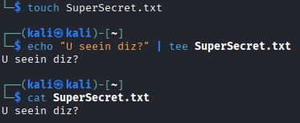

### Käytin näitä ohjeita tiedoston salaamiseen:
Vivek Gite December 9, 2020; Linux: How To Encrypt And Decrypt Files With A Password (https://www.cyberciti.biz/tips/linux-how-to-encrypt-and-decrypt-files-with-a-password.html)

### Asennan gnupg
```
sudo apt-get install gnupg
```

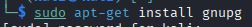

Komento promptasi että X-määrä levytilaa käytetään tämän asennukseen, jatketaanko Y/N? Valitsin `Y` ja enteriä. Seuraavaksi listautui asennettavia kirjastoja ja paketteja.

### Minua kiinnostaa mikä versio
Kokeilin nähdä version komennolla:
```
gpg --version
```
Sain yllätyksekseni myös listauksen mitkä kaikki tiiviste algoritmit ovat tuettuja.

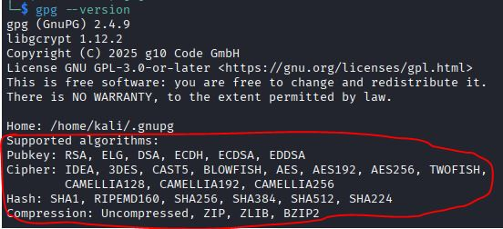

### Salaan tiedoston
```
gpg -c SuperSecret.txt
```

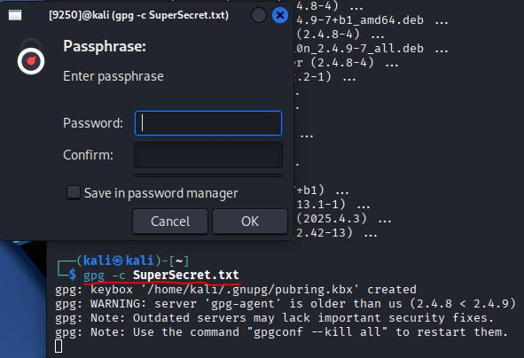

Artikkelin mukaan oletus salaus tiiviste algoritmi on  `AES128`, mutta sitä voi muuttaa.

> [!NOTE]
> Tämä ei taida pitää enää paikkaansa, koska myöhemmin tehtävässä gpg2john tiiviste osoittaa `AES-256` suuntaan.

Asetin salasanksi `SuperSecret`

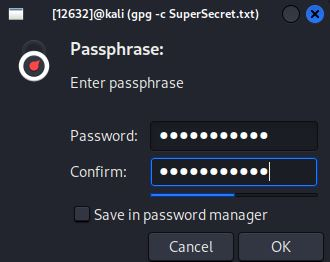

### gpg herjasi salasanaa liian heikoksi. 
Sain kuitenkin asettaa sen.

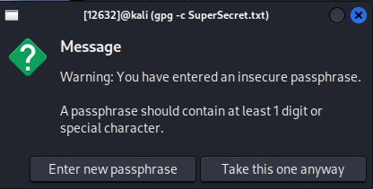

### Tulos
gpg loi salasana suojatun tiedoston `SuperSecret.txt.gpg`

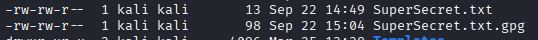


Nyt tiedosto on salakirjoitettu:

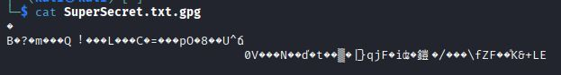

### Murran tiedoston salasanan
Haluan ensin tiedostosta tiivisteen ulos. Käytän gpg2john työkalua tähän

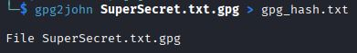

Tässä näette tiivisteen:


```
$gpg$*0*80*efb895fcdc1ebf4ce0edbe43873df3f1b870c2834ff338e980555ed5b30c3056e0daf44efdaa0ec48fa774e8eb18827c7d716a469269caa5ff13e98ea71cb92ffae0b45c665a46b0d1cda34b262b4c45*3*18*10*9*27262976*4213843fb5036dad
```

### REVI SE JONI! 
Aletaan murtamaan tiedoston salausta


John the ripper käyntiin ja annetaan sille tiiviste tiedosto:

```
john gpg_hash.txt
```

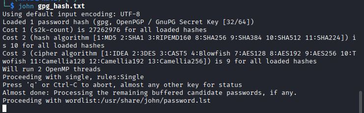

John alkaa nyt testaamaan salasanoja, mutta tässä voi kestää todella kauan sillä minun john the ripper build ei tue näytönohjainlaskentaa. 

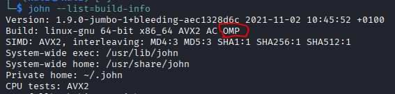

OMP ilmeisesti viittaa OpenMP:hen. Tämä on siis Multi-Processing ja kertoo, että build tukee Ydinten välistä tai säikeiden välille jaettua laskentaa.

FLATPACK (https://github.com/openwall/john-packages/blob/main/readme.md)

### Yrityksessä kesti kauan, joten päätin keskeyttää sen 5min kohdalla.
Valitsemani salasana ei ole oletussanakirjassa! Tarkistin grepillä:

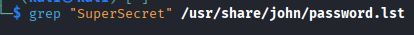

### Uusi yritys salasanalla joka varmasti on sanakirjassa.
Valitsin salasanaksi `kali`. Tarkistin, että se on sanakirjassa:

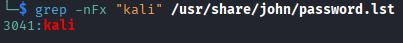

Toistin aiemmat vaiheet uudestaan.

### Salasana löytyi nyt nopeammin

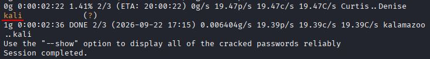


### Teen sanakirjan nopeuttamaan murtoa.
Laitan oleellisia sanoja liittyen salakirjoitettuun tiedostoon. Tiedän esimerkiksi sen tekijän ja hänen henkilötietojaan sekä yksityiskohtaisia asioita hänen elämästään. Tiedän myös varmasti, että tiedosto on `gnupg`:llä salakirjoitettu. Tiedot ovat varmasti salaisia, ehkä jopa "super" salaisia.

```
Kali
kali
kAli
kaLi
kalI
KALI
KAli
kaLI
Sami
sAmi
saMi
samI
Kissa123
kissa123
Salasan
salasana
salainen
secret
supersecret
SuperSecret
Syyskuu2026
SyysKuu2026
September2026
september2026
1234
123456
1234567
12345678
123456789
987654321
87654321
7654321
654321
```

## f) Tiiviste.
> Tee itse tai etsi verkosta salasanan tiiviste, jonka saat auki.
> Murra sen salaus. (Jokin muu formaatti kuin aiemmissa alakohdissa kokeilemasi. Voit esim. tehdä käyttäjän Linuxiin ja murtaa sen salasanan.)

### Luodaan uusi käyttäjä
Ajetaan `adduser`-komento sudona ja annetaan uuden tulokkaan nimi:
```
sudo adduser ROOPE
```
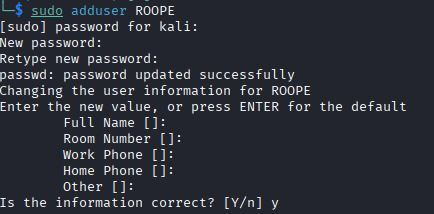

### Otetaan sen salasanan tiiviste shadow tiedostosta:

Katsotaan `shadow` tiedostosta ROOPEN salasanan tiiviste
```
sudo cat /etc/shadow | grep 'ROOPE'
```

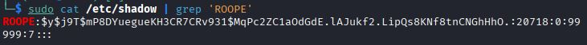

Salasanan tiiviste: `ROOPE:$y$j9T$mP8DYuegueKH3CR7CRv931$MqPc2ZC1aOdGdE.lAJukf2.LipQs8KNf8tnCNGhHhO.:20718:0:99999:7:::`

### Mikä tiiviste formaatti?
Vivek Gite December 19, 2025 Understanding /etc/shadow file format on Linux (https://www.cyberciti.biz/faq/understanding-etcshadow-file/)

Tämän mukaan ROOPEN salasana on tiivistetty `yescrypt`-algoritmillä, koska sen alussa on `$y$`.


### Tein tiedoston ROOPEN tiivisteelle

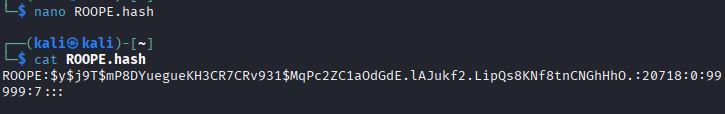

### Käytän sanakirjaa ja yescryptiä
Käytän tekemääni sanakirjaa `KaliSanat`, vivulla: `--wordlist=`

Valitsen formaatin vivulla: `--format=`.

Koko komento:
```
john --format=yescrypt --wordlist=/home/kali/KaliSanat ROOPE.hash
```
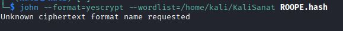

Virhe: `Error: No format matched requested name 'yescrypt'`

### John the ripper ei tunnista formaattia

Törmäsin tähän artikkeliin jossa on samankaltainen ongelma ja ilmeisesti vain **uudempi John the Ripper build** tukee `yescrypt` tiivisteiden murtamista.
Zeliha Zengin Aug 9, 2026 Cracking Yescrypt Password Hashes with an Updated John the Ripper on Kali Linux (https://medium.com/@zeliharich/cracking-yescrypt-password-hashes-with-an-updated-john-the-ripper-on-kali-linux-2ec83e02b9d0)

### Uusi build tulille
Noudatin Zelihan ohjeita

Uusi hakemisto buildille: `mkdir hashed2`

#### Sain virheen kun käytin komentoa:
```
git clone https://github.com/openwall/john.git /hashed2/john
```

Virhe viesti: `fatal: could not create leading directories of '/hashed2/john': Permission denied`
#### Johtui polusta. 
Yritin vahingossa luoda uuden hakemiston.

#### Toimiva komento:
Kopioidaan git repo: `git clone https://github.com/openwall/john.git hashed2/john`

#### Siirrytään source hakemistoon `cd hashed2/john/src`

Konffataan: `./configure`

Luodaan toimiva build: `make -s clean && make -sj2`.
Tässä vaiheessa meni noin 5min.

### AJETAAN UUTTA BUILDIA

Käytän tekemääni sanakirjaa `KaliSanat`, vivulla: `--wordlist=`.
Koko komento:
```
john --format=yescrypt --wordlist=/home/kali/KaliSanat ROOPE.hash
```
Sain saman tuloksen kuin aiemmin.

### Tarkistin komentoni ja se oli väärässä
Royce Williams Jul 27, 2021 vastaa kysymykseen: Does john the ripper not support yescrypt? (https://security.stackexchange.com/questions/252665/does-john-the-ripper-not-support-yescrypt)
Ilmeisesti john the ripper ei tue yescryptiä suoriltaan, mutta libxcrypt kirjaston kautta. Hänen mukaansa täytyy olla järjestelmässä, joka tukee yescryptiä, jotta voi murtaa niitä.

Oikea vipu olisi siis: `--format=crypt`

Joten saan murrettua ROOPEN salasanan komennolla:
```
./run/john --format=crypt --wordlist=/home/kali/KaliSanat ~/ROOPE.hash
```

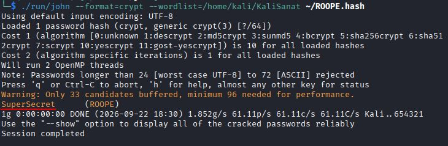

ROOPEN salasana on siis `SuperSecret`.

## g) Sanakirja. 
> Oman sanakirjan teko parantaa onnistumismahdollisuuksia.
> Demonstroi, kuinka teet oman sanakirjan hashcat:n tai john:iin.

### Tässä aiemmasta tehtävästä sanakirjan teko:

#### Teen sanakirjan nopeuttamaan murtoa.
Laitan oleellisia sanoja liittyen salakirjoitettuun tiedostoon. Tiedän esimerkiksi sen tekijän ja hänen henkilötietojaan sekä yksityiskohtaisia asioita hänen elämästään. Tiedän myös varmasti, että tiedosto on `gnupg`:llä salakirjoitettu. Tiedot ovat varmasti salaisia, ehkä jopa "super" salaisia.

```
Kali
kali
kAli
kaLi
kalI
KALI
KAli
kaLI
Sami
sAmi
saMi
samI
Kissa123
kissa123
Salasan
salasana
salainen
secret
supersecret
SuperSecret
Syyskuu2026
SyysKuu2026
September2026
september2026
1234
123456
1234567
12345678
123456789
987654321
87654321
7654321
654321
```

```
nano KaliSanat
```
Kirjoittelin ylempänä listatut sanat tiedostoon ja tallensin `CTRL-O` ja `enter`, sitten `CTRL-X`:llä pois tekstieditorista.

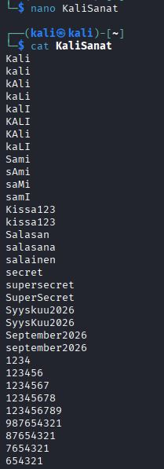


## h) Hash rules. 
> Näytä esimerkki HashCatin sääntöjen käytöstä (rules).

### Best rule 64
Teron vinkki oli katsoa rule64 toimintaa. En kuitenkaan löytänyt sitä Hashcatin hakemistosta, mutta löysin `best66` säännöt.

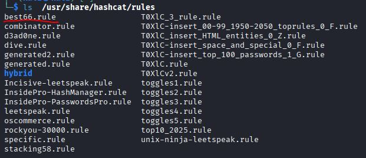


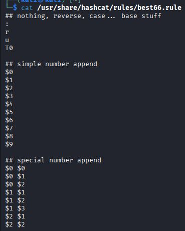

#### Sen sisältö alkaa näillä säännöillä:
Hashcat documents: Rule-based attack(https://hashcat.net/wiki/doku.php?id=rule_based_attack)

- `:` — ei tee mitään. Alkuperäinen sana säilyy sellaisenaan.
- `r` — reverse: kääntää sanan merkkijonon ympäri.
  password → drowssap
- `u` — uppercase: muuttaa kaikki kirjaimet isoiksi.
  password → PASSWORD
- `T0` — toggle case at position 0: vaihtaa ensimmäisen merkin kirjainkoon.
  password → Password

### Pikku demo
Katsotaan millaista variaatiota saadaan aikaan kun käytetään best66. 

Löysin hashcatin dokumenteista hyvän vivun testaamiseen, `--stdout`. Sillä voidaan tulostaa sanakirja ilman, että sitä muutetaan. Hashcat documents: Rule-based attack, Debugging rules(https://hashcat.net/wiki/doku.php?id=rule_based_attack)

Sääntöjä käytetään vivulla: `-r`. Sen perään lisätään sääntö tiedosto. Siihen lisäämällä `--stdout` ja sanakirja, voidaan katsoa millaista settiä olisi tulossa.
```
hashcat -r /usr/share/hashcat/rules/best66.rule --stdout KaliSanat
```

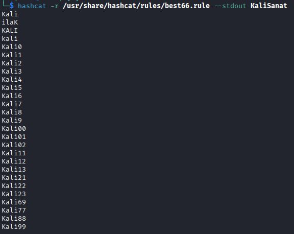

Melko vääntöä. Sanakirja olisi kasvamassa toista sataa riviä. Tämä on aika tehokasta.


## Lähdeluettelo
- Tero Karvinen 2026 late spring: Tunkeutumistestaus, Toukokuu2026! (https://terokarvinen.com/tunkeutumistestaus/) (Luettu 9.5.2026)
  
- Karvinen 2022: Cracking Passwords with Hashcat (https://terokarvinen.com/2022/cracking-passwords-with-hashcat/) (Luettu 9.5.2026)

- Karvinen 2023: Crack File Password With John(https://terokarvinen.com/2023/crack-file-password-with-john/) (Luettu 9.5.2026)

- openwall john: INSTALL (https://github.com/openwall/john/blob/bleeding-jumbo/doc/INSTALL) (Luettu 9.5.2026)

- Vivek Gite December 9, 2020; Linux: How To Encrypt And Decrypt Files With A Password (https://www.cyberciti.biz/tips/linux-how-to-encrypt-and-decrypt-files-with-a-password.html) (Luettu 22.9.2026)

- FLATPACK (https://github.com/openwall/john-packages/blob/main/readme.md) (Luettu 22.9.2026)

- Vivek Gite December 19, 2025 Understanding /etc/shadow file format on Linux (https://www.cyberciti.biz/faq/understanding-etcshadow-file/) (Luettu 22.9.2026)

- Zeliha Zengin Aug 9, 2026 Cracking Yescrypt Password Hashes with an Updated John the Ripper on Kali Linux (https://medium.com/@zeliharich/cracking-yescrypt-password-hashes-with-an-updated-john-the-ripper-on-kali-linux-2ec83e02b9d0) (Luettu 22.9.2026)

- Royce Williams Jul 27, 2021 answer to: Does john the ripper not support yescrypt? (https://security.stackexchange.com/questions/252665/does-john-the-ripper-not-support-yescrypt) (Luettu 22.9.2026)

- Hashcat documents: Rule-based attack(https://hashcat.net/wiki/doku.php?id=rule_based_attack) (Luettu 22.9.2026)
