# h6 Fuzzy Feeling Upon Finding
[Tero Karvinen 2026 early autumn: Tunkeutumistestaus, Fuzzy Feeling Upon Finding](https://terokarvinen.com/tunkeutumistestaus/#h6-fuzzy-feeling-upon-finding)

## Ympäristö
- kali-linux-2025.4-virtualbox-amd64
  - Debian (64-bit)
  - 4096 MB base memory
  - 2 vCPU
  - NAT Network adapter
  - Host-only network adapter
  - Firefox 128.3.1esr (64-bit)
 
- Metasploitable 2
  - Oracle Linux (64-bit)
  - 2048 MB base memory
  - 1vCPU
  - Host-only network adapter
 
- LLM GPT-5.6 Luna

## x) Lue/katso/kuuntele. 
(Tässä x-alakohdassa ei tarvitse tehdä testejä tietokoneella, vain lukeminen tai kuunteleminen ja tiivistelmä riittää. Tiivistämiseen riittää muutama ranskalainen viiva kustakin artikkelista. 
Kannattaa lisätä myös jokin oma ajatus, idea, huomio tai kysymys.

### Hoikkala 2026: [Fuzzing with Fuff, kalvot](https://terokarvinen.com/tunkeutumistestaus/hoikkala-2026-fuzzing-with-ffuf.pdf) joohoin esityksestä kurssilta.

- Fuff on bruteforce työkalu, jolla voidaan etsiä "signaaleja" mahdollisista haavoittuvuuksista verkkopoluissa.
- Suunniteltu erittäin suurille määrille http-pyyntöjä lyhyessä ajassa.
- Hyödyntää sanakirjoja. Tukee monia 
- Sain esityksestä vaikutelman, että Fuff on saavuttanut vakiopaikan fuzzer työkalujen kärjestä.
- Live esityksessä Joona Hoikkalan mukaan moni web-app on alkanut automaattisesti pudottamaan HTTP-pyyntöjä, jotka sisältävät "Fuff"-sanan, jonka takia Fuff yrittää teeskennellä user-agentti otsakkeen avulla olevansa FireFox selain. Tälle huomiolle en löytänyt luotettavaa lähdettä. Joudut uskomaan minun olleen paikalla kuuntelemassa, Hoikkalan esitystä.
- Preflight pyynnöt joilla saadaan CSRF-token oikealle bruteforce pyynnölle on uusi ja hieno ominaisuus fuffissa.

### Vapaaehtoista lisälukemistoa
#### Karvinen 2023: Find Hidden Web Directories - Fuzz URLs with ffuf (https://terokarvinen.com/2023/fuzz-urls-find-hidden-directories/)
- Ohjeet ladata fuff ja päästä fuzzauksessa alkuun.
- Fuffilla voidaan löytää piilotettuja hakemistoja.
- Ffufille annetaan sanakirja (wordlist), jossa on yleisiä hakemistojen nimiä, kuten `admin`, `.svn` ja `dashboard`.
- `200 OK` ei välttämättä tarkoita, että sivu löytyi. Käytä filttereitä lötääksesi osumia.
- Tätä artikkelia voisi päivittää sisältämään fuffin auto calibrate ominaisuuksia.

#### Hoikkala 2026: ffuf README.md (https://github.com/ffuf/ffuf/blob/master/README.md)
- fuff on ohjelmoitu `GO`:lla ja tarvitsee version `1.20` tai uudemman.
- Linkit ohjeisiin fuffin asentamisesta eri käyttöjärjestelmillä.  
- Esimerkkejä fuffin käyttöön. 
  
#### Hoikkala "joohoi" 2020: Still Fuzzing Faster (U fool) (https://www.youtube.com/watch?v=mbmsT3AhwWU) In HelSec Virtual meetup #1. (Noin tunnin mittainen)


## a) Tallenna itsellesi kopio säännöistä. 
### Vaultline (https://ffuf.io.fi/play)

#### Kirjoita omin sanoin, Scope. Mikä on kohde?

Tämä webbisivu `https://ffuf.io.fi/play` on fuffin esittelyä varten rakennettu demo kohde internetissä. Sen omistaa `Vaultline Oy` · Turku, Finland.
Kohteeseen saa tehdä fuzzaus HTTP-pyyntöjä ja käyttää sivun harjoituksissa kuvattuja tekniikoita.

#### Rules of engagement. Mitä sille saa tehdä, eli mitä tai millaisia menetelmiä saa käyttää?
Sivun tehtävissä olevia fuzzaus menetelmiä ja erikseen mainittuja fuffin lippuja saa käyttää tehtävien ratkomiseen:

#### Mihin oikeutesi tehdä tietoturvatestausta tähän kohteeseen perustuu?
- Sivulla sanotaan suoraan, että kyseessä on “FUZZING DEMO TARGET” ja että kohteeseen on tarkoitus osoittaa ffuzzausta.
- Palvelun ylläpitäjä on itse asettanut kyseisen palvelimen fuzzauksen harjoittelukohteeksi ja julkaissut siihen liittyvät säännöt sekä tehtävät.

#### Riskit ja mitigointi. Tuo palvelin on Internetissä. Tunnista lyhyesti riskit ja niiden mitigointi ennen käytännön harjoittelua.
| Riski | Mitigointi |
|---|---|
| Väärään kohteeseen kohdistuva testi | Tarkistetaan URL ja kohde ennen testin aloittamista |
| Liian suuri pyyntömäärä voi kuormittaa palvelinta | Käytetään tarvittaessa pyyntönopeuden rajoitusta (`-rate`) |
| Rekursiivinen fuzzing voi kasvattaa pyyntömäärää nopeasti | Rajoita rekursion syvyyttä (`-recursion-depth`) |
| Testi voi vahingossa ulottua luvallisen kohteen ulkopuolelle | Varmista, että kaikki pyynnöt kohdistuvat harjoituskohteeseen |


## b) Asenna ffuf versio, joka tukee aivan uutta preflight-ominaisuutta.
Vaultline (https://ffuf.io.fi/play) sivun lopussa mainitaan vaatimukset ffufin versiosta:
`-preflight` shipped in ffuf `v2.3.0.` Older builds do not have the flag at all: `ffuf -h | grep -c preflight` should not print 0.

### Tein hakemiston ffuf juttuja varten
```
mkdir fuff_stuff
```

### Latasin valmiin binäärin FFUFFIn githubista
Uusin versio on `2.3.0`
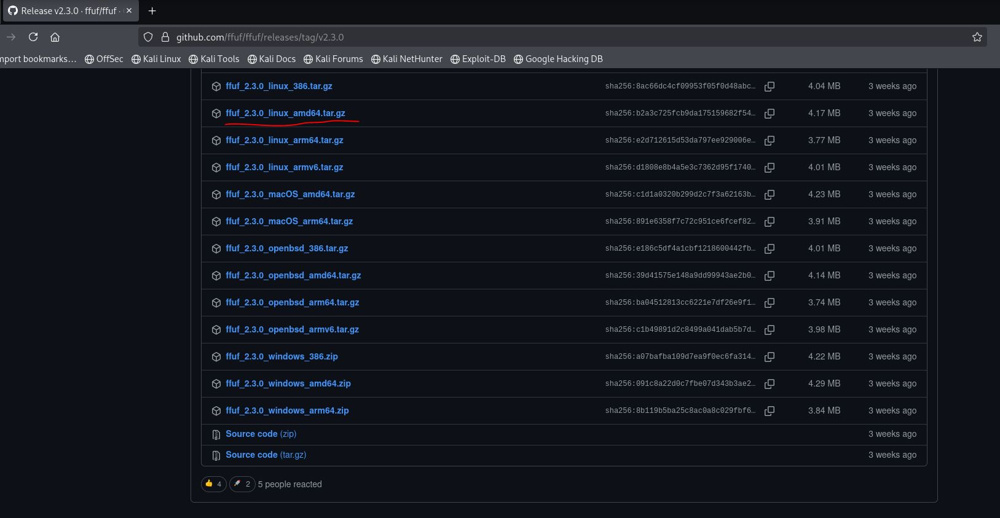

### Purin tar.gz tiedoston


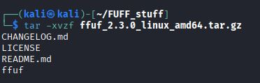


### Törmäsin ongelmaan
Yritin ajaa komennon: `ffuf -h | grep -c preflight`.
Se tulostaa nollan, joten käytössä on liian vanha versio.

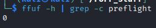

### Huomasin ettei komento ajanut hakemistossa olevaa binääriä
Käyttämäni komento puhutteli pakettienhallinnasta lataamaani versiota ffuffista. Olen viime keväänä testaillut ffuffia ja päivittänyt sitä nyt syksyllä.
APT-pakettienhallinnassa oleva versio ei ole vielä sama, kuin githubissa uusin.

APT:sta lataamani `versio 2.2.1-1`.


### Muutin komentoa hieman
`./ffuf -h | grep -c preflight`.
Sain lisäämällä komennon alkuun `./`, ajettua hakemistossa olevaa binääriä. Tämä tulosti numeron `4`

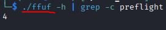

### Lataamani binääri siis toimii
En tykkää siitä, että joudun puhuttelemaan erikseen tässä hakemistossa binääriä. Siirrän binäärin polkuun `/usr/local/bin/`, jotta voin ajaa sitä kaikkialta. Poistan ensin `APT`:sta asennetun ffuffin komennolla: `sudo apt remove ffuf`.

#### Siirrän ffuffin polkuun
`sudo mv ffuf /usr/local/bin`


### Hankintaan sanakirja
Teron [ohjeista]((https://terokarvinen.com/2023/fuzz-urls-find-hidden-directories/)) löytyy komento, jolla voidaa imuroida Daniel Miesslerin githubista `common.txt` niminen sanakirja. Imuroin sen testausta varten komennolla:
```
wget https://raw.githubusercontent.com/danielmiessler/SecLists/master/Discovery/Web-Content/common.txt
```

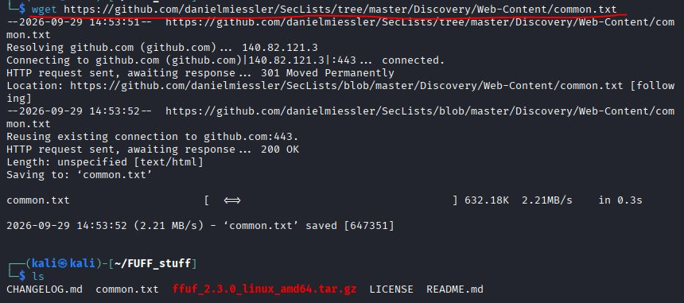

## c1) Content discovery (Vaultline https://ffuf.io.fi/play tehtävät on numeroitu näin, käytetään tässä samoja.).

| Goal | Flags in play |
|---|---|
| Find the paths that exist but are not linked from anywhere. | `-w`, `-mc`, `-fw`, `-ac` |

### Ajetaan komentoja
Kokeillaan ensin ajaa sanakirjan kanssa lipulla `-w` ja katsotaan mitä saadaan näkymään.
```
ffuf -w ./common.txt -u  https://ffuf.io.fi/play
```
Lipulla `-u` määritetään kohde URL.

Näyttäisi siltä, että sain vain yhden vastauksen, joka on `status 200 OK`

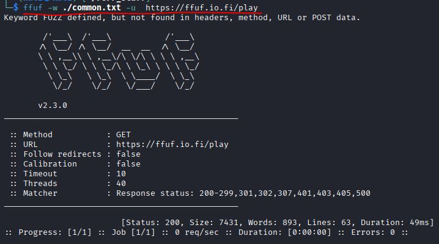

### Kokeillaan `-mc`-lippua
FFUFin help sivujen avulla näen, että `-mc`-lipulla otetaan huomioon vain määrätyt `HTTP-status koodit`
Help sivuilta löysin tiedon rajaamalla tällä komennolla:
```
ffuf -h | grep 'mc'
```
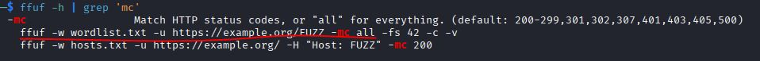

### Otetaan kaikki status koodit
```
ffuf -w ./common.txt -u  https://ffuf.io.fi/play -mc all
```

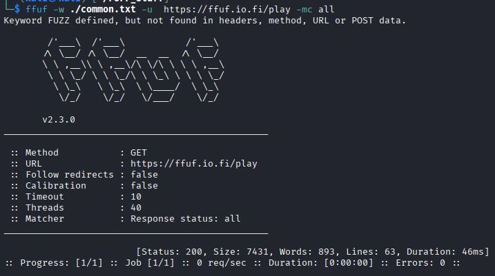

Ei pahemmin muutosta aiempaan.

### Kokeillaan `-fw`-lippua

Hain lipulle samalla tavalla tietoa help sivulta, mutta siellä ei ollut käyttöesimerkkejä.

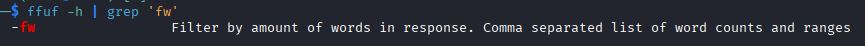

Lippu kuitenkin filtteröi sanamäärän mukaan. Jos en halua nähdä tuloksia, jotka sisältävät saman määrän sanoja kuin perus HTTP-vastaus, voin käyttää tätä lippua sulkemaan ne pois.

Edellisen yrityksen tuloksesta näen, että vastauksena tulee `893` sanaa. Filtteröin ne pois:
```
ffuf -w ./common.txt -u  https://ffuf.io.fi/play -mc all -fw 893
```
Ei mitään ihmeellistä tulosta. Alkaa vaikuttaa siltä, ettei sivulla ole piilohakemistoja tai sanakirja ei pelitä.

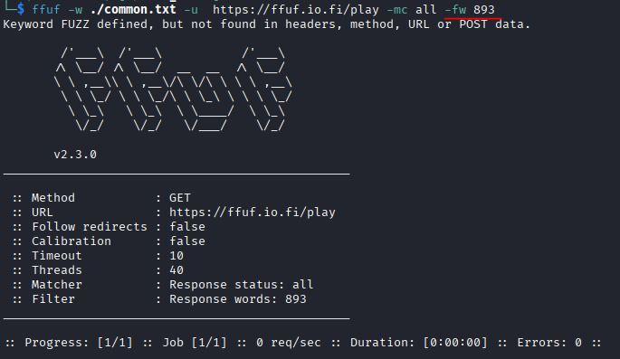

### Viimeinen lippu `-ac`
Kyseessä on siis auto calibrate. Tällä säädetään automaattisesti filtteröinti asetuksia.

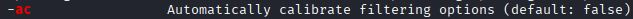

#### Ajan komennolla
```
ffuf -w ./common.txt -u  https://ffuf.io.fi/play -ac
```

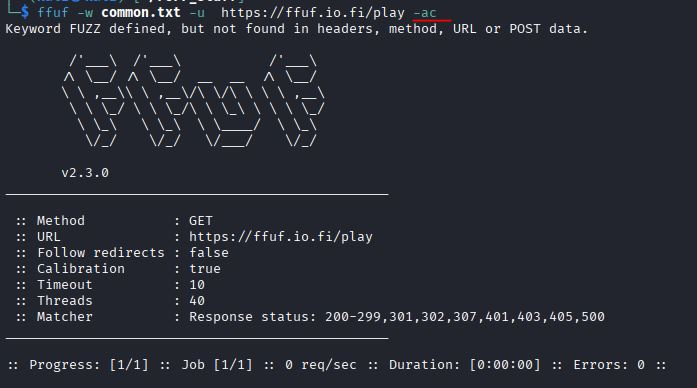

Voidaan huomata, ettei tapahtunut taaskaan mitään mielenkiintoista.

## En huomannut ilmiselviä
Olen käyttänyt vääränlaista komentoa. En ole määrittänyt url:issa kohtaa johon kokeillaan sanakirjan sisältöä ja siksi en saanut mitään tuloksia. Suoritus ei edes käynnistynyt.
### Annoin komennon
```
ffuf -w ./common.txt -u  https://ffuf.io.fi/play/FUZZ -ac
```
### Tämä ilmaisi aivan uuden virheen:
```
Encountered error(s): 1 errors occured.
        * bufio.Scanner: token too long
```


### Annoin virheviestin pureksittavaksi Chatgpt:lle
Kielimallin GPT-5.6 Luna mukaan: Go:n bufio.Scanner käyttää oletuksena rajattua tokenikokoa, ja ffuf törmää liian pitkään wordlist-riviin.

Eli siis bufio.Scannerin tokenikoko ylittyy ja Chatgpt neuvoi seuraavaksi tarkistamaan sanakirjan pisimmät rivit. En halua alkaa miettimään sen enempää tätä, joten lataan sanakirjan vain uudelleen.

### En saa enää samaa virhe viestiä.
Nyt ffuf suorittaa komennot ja palauttaa paljon enemmän vastauksia.

Tässä on ensimmäisen komennon `ffuf -w ./common.txt -u  https://ffuf.io.fi/play/FUZZ` tuloste:


Nyt voidaan huomata edistyminen `[4752/4752]`. Saadaan siis neljätuhatta seitsemänsataa viisikymmentä kaksi vastausta. Ja vastaukset näyttäisi olevan 135 sanaa pitkiä. 

Seuraavaksi kokeilin vain `-fw` ja `-ac` liput uudelleen, koska ne ovat mielestäni tehokkaimpia:

### -ac
En saanut yhtään osumia `-ac`-lipulla


### -fw
En saanut sanamäärää filtteröimällä mitään


## Luin how to play ohjeet uudelleen
Tajusin käyttäväni eri sanakirjaa kuin ohjeessa.

### Asensin sanakirjat `content.txt` ja `passwords.txt`
```
curl -O https://ffuf.io.fi/wordlists/content.txt
```
```
curl -O https://ffuf.io.fi/wordlists/passwords.txt
```


### Testi `-ac`:lla


#### En saanut `ffuf.io.fi/play/FUZZ` alta yhtään osumaa
Kokeillaan seuraavaksi sen yläpuolelta `ffuf.io.fi/FUZZ`


### Huomattavasti parempi tulos
Katsoin selaimessa miltä `admin`-sivu näyttää:


#### Vautsi

## c2) The interesting non-200
| Goal | Flags in play |
|---|---|
| Two planted paths do not answer 200. One of them a default run will not even consider. | `-mc all`, `-fc` |

### Aiemmat vastaukset
Tiedän aiemmista vastauksista, että suurinta osaa käsitellään koodilla `200 OK` ja että `-mc all` palauttaa kaikki statuskoodit. Mutta, mitä `-fc` tekee? Help sivuilla lukee, että sillä voidaa filtteröidä statuskoodien mukaan. Joten jos haluan nähdä muut kuin `200 OK`, minun on filtteröitävä se pois:

```
ffuf -w content.txt -u https://ffuf.io.fi/FUZZ -fc 200
```


Sain siis vastaukseksi `301` ja `403` koodit.

#### 301 moved permanently
Mozzilla docs, HTTP status codes: 301 (https://developer.mozilla.org/en-US/docs/Web/HTTP/Reference/Status/301)
Haettava resurssi on siiretty toiseen URL-osoitteeseen


#### 403 forbidden
Mozzilla docs, HTTP status codes: 403 (https://developer.mozilla.org/en-US/docs/Web/HTTP/Reference/Status/403)
Palvelin vastaanotti pyynnön, mutta ei käsittele sitä.


## c3) Recursion
| Goal | Flags in play |
|---|---|
| The wordlist holds names, not paths, so C1 found you 13 things and none of them nested. Descending finds more. | `-recursion`, `-recursion-depth` |

### Recursion lippu
Tarkistetaan mitä siitä kerrotaan help sivuilla:
```
ffuf -h | grep 'mc'
```


`-recursion` antaa ffuffin sukeltaa syvemmälle löytyneeseen hakemistoon.

### Testataan
Lisään aiemmin käyttämääni auto calibrate komentoon lipun `-recursion` ja katson mitä tapahtuu.
Komennolla
```
ffuf -w content.txt -u https://ffuf.io.fi/FUZZ -ac -recursion
```
Tulostuksena tuli:


Sieltä löytyi paljon samoja osumia, mutta vielä ei mennä kovin syvälle niiden sisään, kun `recursion-depth` on oletuksena 0.

### Testataan mennä syvemmälle
```
ffuf -w content.txt -u https://ffuf.io.fi/FUZZ -ac -recursion -recursion-depth 2
```

Muutamalla hakemistolla oli alihakemistoja, mutta tulostus on melko sotkuista, kun kaikkia osumia tutkitaan samaan aikaan.

Voidaan siis mennä vielä syvemmälle esimerkiksi `/files/reports/2026/`.


### Katsotaan miten syvälle päästään
Tutkitaan `/files/reports/2026/` komennolla: 
```
ffuf -w content.txt -u https://ffuf.io.fi/files/FUZZ -ac -recursion -recursion-depth 5
```
Pohja vihdoin löytyi. Ei ole enempää sisältöä kuin `ffuf.io.fi/files/contracts/` ja  `ffuf.io.fi/files/reports/2026/draft/`


#### Selaimessa


### Rekursiivinen fuzzaaminen on aika edistyksellistä
Tämä säästää huomattavasti aikaa, kun yrittää etsiä mielenkiintoista sisältöä.

## c4) Virtual hosts
| Goal | Flags in play |
|---|---|
| Three hostnames under ffuf.io.fi serve different content from this same address. Find all three. | `-H "Host: FUZZ.ffuf.io.fi"`, `-fw` |


## c9) The login you cannot replay (Has preflight! Has CSRF token!)
| Goal | Flags in play |
|---|---|
| Get into the admin account. A plain password fuzz returns 403 forever, however long you run it. | `-preflight`, `-preflight-var`, `-preflight-mode` |


## Vapaaehtoisena muut Vaultlinen tehtävät


## Lähdeluettelo
- Tero Karvinen 2026 early autumn: Tunkeutumistestaus, fuzzy feeling upon finding (https://terokarvinen.com/tunkeutumistestaus/#h6-fuzzy-feeling-upon-finding) (Luettu 29.9.26)

- Hoikkala 2026: Fuzzing with Fuff, kalvot esityksestä Tunkeutumistestauksen kurssilla (https://terokarvinen.com/tunkeutumistestaus/hoikkala-2026-fuzzing-with-ffuf.pdf) (Luettu 29.9.26)

- Karvinen 2023: Find Hidden Web Directories - Fuzz URLs with ffuf (https://terokarvinen.com/2023/fuzz-urls-find-hidden-directories/) (Luettu 29.9.26)

- Hoikkala 2026: ffuf README.md (https://github.com/ffuf/ffuf/blob/master/README.md) (Luettu 29.9.26)

- Hoikkala "joohoi" 2020: Still Fuzzing Faster (U fool) In HelSec Virtual meetup #1. (https://www.youtube.com/watch?v=mbmsT3AhwWU) (Luettu 29.9.26)

- Vaultline, ffuf demo target (https://ffuf.io.fi/play) (Luettu 29.9.26)

- Seclists(https://github.com/danielmiessler/SecLists)

- Mozzilla docs, HTTP status codes: 301 (https://developer.mozilla.org/en-US/docs/Web/HTTP/Reference/Status/301)

- Mozzilla docs, HTTP status codes: 403 (https://developer.mozilla.org/en-US/docs/Web/HTTP/Reference/Status/403)
